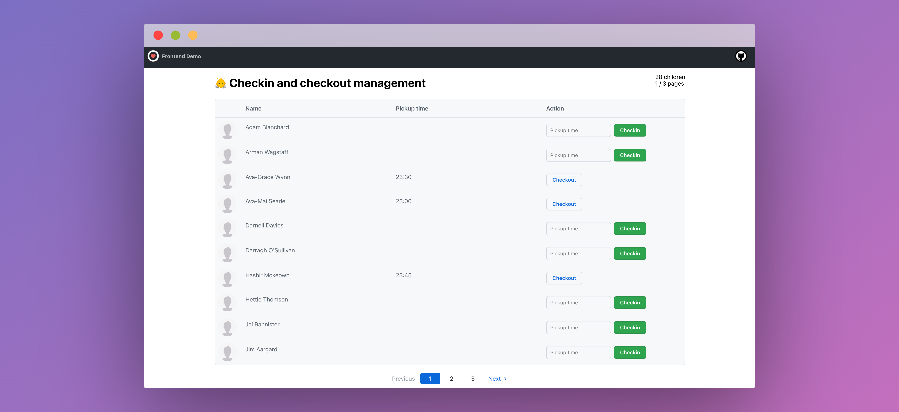

# React demo app &middot; [](https://github.com/zoles/hire-me/actions/workflows/ci.yml)

A simple React app to display a list of children in a table with pagination and perform Checkin and Checkout operations of the records using the given API endpoints.

## Live demo & CI/CD

[You can find a live demo of this reopsitory here](https://zoles.github.io/hire-me)

A [GitHub action](https://github.com/zoles/hire-me/actions/) is executed on each _push_ to the repository:

- npm install, build
- run tests
- deploy to [GitHub pages](https://zoles.github.io/hire-me)



## Installation

1. Clone this reopsitory
2. Add your API access token in the _.env_ file: `REACT_APP_ACCESS_TOKEN='<accessToken>'`
3. `npm install` or `yarn install`
4. `npm start` or `yarn start`
5. Open [http://localhost:3000](http://localhost:3000) to view it in the browser

## Technologies / Tools

- React.js ([Create React App](https://github.com/facebook/create-react-app) with TypeScript)
- [Primer React](https://primer.style/react/)
- [Axios](https://axios-http.com/)
- [Context API](https://reactjs.org/docs/context.html)

**State management:** Redux would have been an overkill for this simple app.
In this example there are only few components and communication between them could be done by passing props to each other, but I tried to find a middle ground and used Context as 'global' state management as data can be shared between all the components within the application.

**Design considerations:** the UI is oversimplified since the focus wasn't on that. I used GitHub's Primer design instead of Material (MUI), the most commonly used design for such tasks.
The items are listed in a table with pagination, however in real life scenario I assume there are only limited number of children in a group and the check-in/out happens on a tablet or a phone, therefore a card view with infine scrolling could be a better solution - with some predefined filters to list eg. only checked-in or checked-out children.

## Limitations and known bugs:

- No error handling for API calls
- No pickup time validation and time zone handling
- No real testing implementation
- Please note that after checkout the _checkinTime_ and _pickupTime_ don't change and not added to the _checkins_ array in the fetch all children API response. Since I don't know the exact business logic, maybe it's by design.

<details>
  <summary>Interested in working for Famly?</summary>

# Interested in working for Famly?

Give us a chance to see your beautiful code! 🤩

How to get started:

- Fork this repository
- Create a small application in React (or another agreed upon framework)
- Describe your design decisions and setup instructions in the README.md of the forked repository

The application should be able to do 3 things:

1. List children with some form of pagination/lazy-loading/infinite-scroll
2. Checkin a child
3. Checkout a child

There are no other requirements than that—don't worry about design or anything like that.

If you have any questions feel free to reach out to ckl@famly.co (Christian) or ab@famly.co (Adam) ☺️

## API Specification

You will receive an access token in an email during the recruiment process.

### Fetch some children from

The API does not support any limit or offset, so the pagination/lazy-loading/infinite-scroll will have to be done client-side only.

```
GET https://app.famly.co/api/daycare/tablet/group
Arguments: {
	accessToken: <accessToken>,
	groupId: '86413ecf-01a1-44da-ba73-1aeda212a196',
	institutionId: 'dc4bd858-9e9c-4df7-9386-0d91e42280eb'
}
```

Example in cURL:

```bash
curl "https://app.famly.co/api/daycare/tablet/group?accessToken=<accessToken>&groupId=86413ecf-01a1-44da-ba73-1aeda212a196&institutionId=dc4bd858-9e9c-4df7-9386-0d91e42280eb"
```

### Checkin child

```
POST https://app.famly.co/api/v2/children/<childId>/checkins

Arguments: {
	accessToken: <accessToken>
	pickupTime: 16:00
}
```

Example in cURL:

```bash
curl \
  -d 'accessToken=<accessToken>&pickupTime=16:00' \
  https://app.famly.co/api/v2/children/fcd683d0-bc31-468c-948f-1ca70b91439d/checkins
```

### Checkout child

```
POST https://app.famly.co/api/v2/children/<childId>/checkout
Arguments: {
	accessToken: <accessToken>
}
```

Example in cURL:

```bash
curl \
  -d 'accessToken=<accessToken>' \
  https://app.famly.co/api/v2/children/fcd683d0-bc31-468c-948f-1ca70b91439d/checkout
```

</details>
